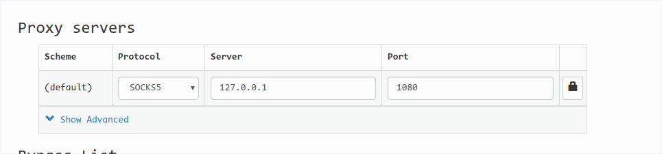

# proxy-setup 
Auto deploy a proxy(Socks5) proxy

# Delpoy using script

Source the script:

`source ./proxy.sh`

`setup_all`

kill service:

`kill_all`

once the function add into your enviroment,you can using the function install launch the kcp,shadowsocks,see the help message of script.

Proxy addr:
```
http://127.0.0.1:2019
socks5://127.0.0.1:1080
```

NOTE: **deploy a http proxy in android has a little complex**, It need port privoxy to android and compile binary as PIE struct dut to Android Security mode.so the http proxy is not usable yet

test proxy:
```
export all_proxy="socks5://127.0.0.1:1080"
or
export all_proxy="http://127.0.0.1:2019"
curl https://www.ip.cn
```

Next , using Chrome with [SwitchyOmega](https://github.com/FelisCatus/SwitchyOmega)


TODO: deploy http proxy in android
